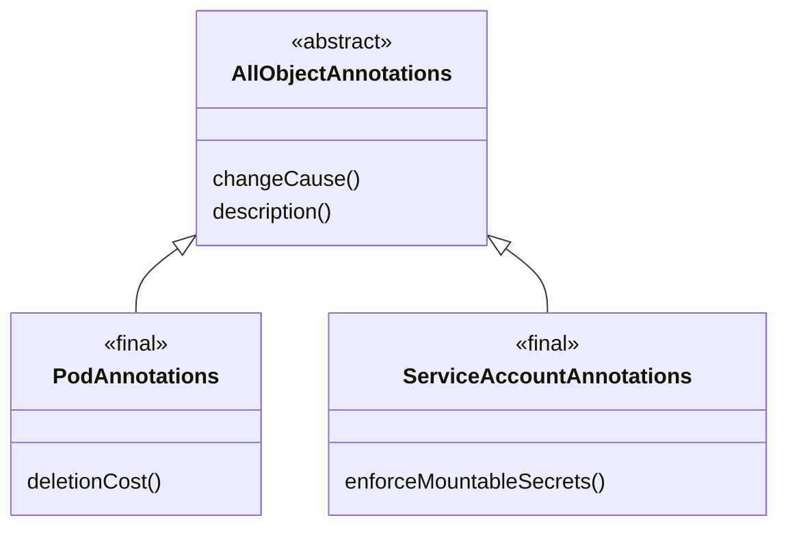
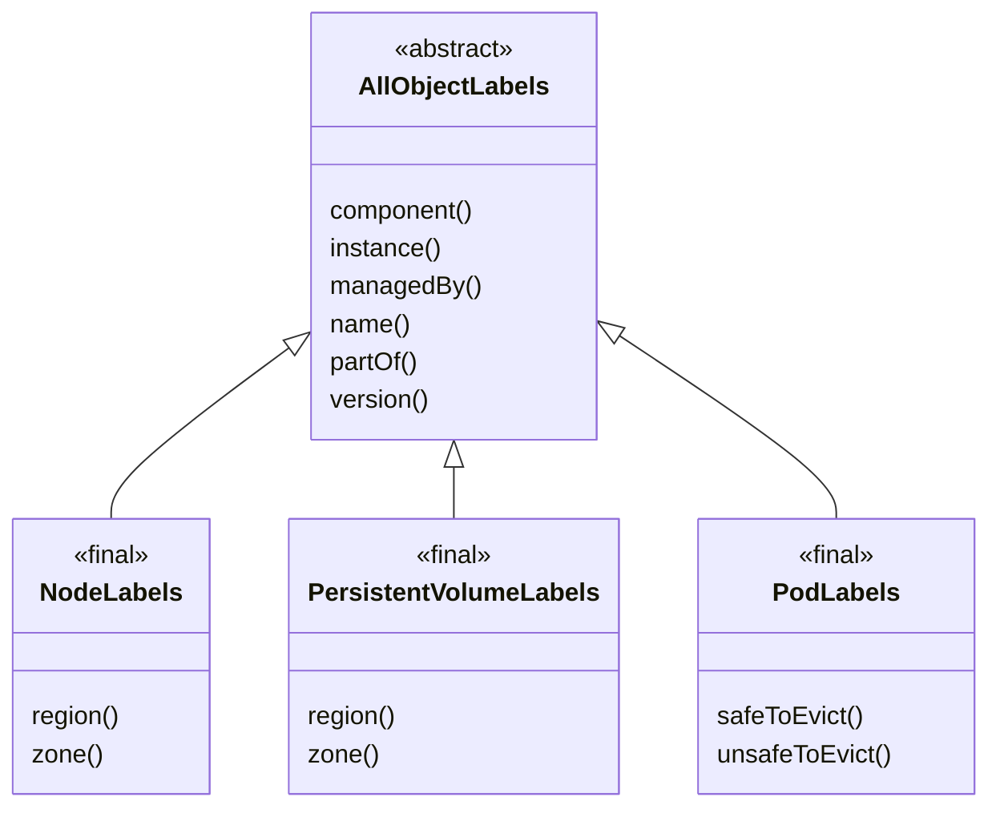

## Kubernetes Reference

### Well known annotations and labels

```mermaid
classDiagram
    class AllObjectAnnotations
    <<abstract>> AllObjectAnnotations
    class PodAnnotations
    <<final>> PodAnnotations
    class ServiceAccountAnnotations
    <<final>> ServiceAccountAnnotations
    AllObjectAnnotations <|-- PodAnnotations
    AllObjectAnnotations <|-- ServiceAccountAnnotations
    AllObjectAnnotations : changeCause()
    AllObjectAnnotations : description()
    PodAnnotations : deletionCost()
    ServiceAccountAnnotations : enforceMountableSecrets()
```

### Well known labels

```mermaid
classDiagram
    class AllObjectLabels
    <<abstract>> AllObjectLabels
    class NodeLabels
    <<final>> NodeLabels
    class PersistentVolumeLabels
    <<final>> PersistentVolumeLabels
    class PodLabels
    <<final>> PodLabels
    AllObjectLabels <|-- NodeLabels
    AllObjectLabels <|-- PersistentVolumeLabels
    AllObjectLabels <|-- PodLabels
    AllObjectLabels : component()
    AllObjectLabels : instance()
    AllObjectLabels : managedBy()
    AllObjectLabels : name()
    AllObjectLabels : partOf()
    AllObjectLabels : version()
    NodeLabels : region()
    NodeLabels : zone()
    PersistentVolumeLabels : region()
    PersistentVolumeLabels : zone()
    PodLabels : safeToEvict()
    PodLabels : unsafeToEvict()
```
